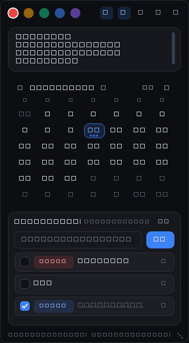

<div align="center">

# smallM

**极简 · 炫酷 · 零阻尼的桌面悬浮备忘 / 日历 / 日程工具**

一张常驻屏幕角落的玻璃卡片，装下你的碎片想法、待办日程与整月记忆。




</div>

---

## ✨ 功能一览

| 模块 | 说明 |
| --- | --- |
| 📝 **5 张独立画布** | 顶部莫兰迪彩色圆点切换，150ms 淡入；**打字即时落盘**，无需保存 |
| 📅 **动态月历** | 有记录的日期下方带发光热度点；**鼠标悬停**浮出当天全部待办 |
| ⏰ **日程 + 到点提醒** | **右键输入框（或点左侧 ⏰ 胶囊）直接选提醒时间**，常用时间一键点，不用手打；到点弹出**全屏居中覆盖提醒**（知道了 / 延后 10 分钟 / 标记完成）+ 系统提示音 |
| 🗂 **历史回溯** | 点击月历任意日期，下方清单**原地切换**为该日日程，不叠加第二个面板 |
| 🗒 **多条目清单** | 逐条独立卡片：复选框 + 时间胶囊 + 🗑；勾选自动划线沉底，删除只影响该条 |
| ⚡ **零阻尼交互** | 全程无确认弹窗；删除/清空秒删 + 底部滑出 3 秒撤销条 |
| 📋 **一键导出** | 把当天待办整理成 `1. 2. 3.` 编号列表复制到剪贴板，**直接粘贴**到聊天/邮件/文档 |
| 🪟 **可自由调节** | 拖窗口边缘或右下角抓手缩放，尺寸自动记忆；画布高度随内容自适应，也可手动拖分割条 |
| 🎨 **Raycast 暗黑风** | `#0d0e11` 底 + `#16181d` 卡片 + 1px 微发光边框 + 14px 圆角 + 20px 弥散阴影 |
| 🫥 **防打扰悬浮** | 鼠标移出窗口透明度平滑降到 `0.35`，移入 0.15s 顺滑恢复；🔒 可锁定常显 |
| ⌨️ **全局速记** | 任何软件里按 `Alt+Q` 浮出输入条，回车即入库；`@3` 可指定写入第 3 张画布 |
| 🔒 **纯本地** | 数据只写入本地 `memos.json`，不联网、不上传、无遥测 |

> 只依赖 **PyQt6**，其余全部使用 Python 标准库与 Win32 原生能力（全局热键、系统通知），常驻内存约 80 MB。

## 系统要求

- **Windows 10 / 11**（系统通知、全局热键依赖 Windows API）
- 从源码运行需 **Python 3.9+**（推荐 3.12）

---

## 📥 Release 下载指南（推荐：零依赖）

1. 打开仓库页面右侧的 **Releases**，或直接访问
   👉 **https://github.com/MNZ-CX/smallM/releases/latest**
2. 在最新版本（**Latest**）的 **Assets** 区域点击 **`smallM.exe`** 开始下载（约 35 MB）
3. 把 `smallM.exe` 放到一个**可写目录**，例如 `D:\Tools\smallM\`

   > ⚠️ 不要放进 `C:\Program Files` —— 程序需要在**同级目录**写入 `memos.json`，系统目录无写入权限

4. 双击运行。首次可能弹出 Windows SmartScreen 蓝色提示（exe 未做代码签名，属正常现象）：
   点击 **「更多信息」→「仍要运行」**
5. 启动后窗口出现在屏幕右侧，托盘出现图标，`memos.json` 会自动生成在 exe 同级目录

**想开机自启？** 给 `smallM.exe` 建个快捷方式，丢进 `shell:startup`（`Win + R` 输入 `shell:startup` 回车即可打开该文件夹）

---

## 🚀 使用速查

| 操作 | 方式 |
| --- | --- |
| 切换画布 | 点顶部 5 个彩色圆点（底栏显示 `画布 X/5`） |
| 新建日程 | **右键输入框**（或点左侧 **⏰ 胶囊**）选提醒时间 → 输入内容 → 回车 / 点「添加」<br>菜单内含：不提醒 / 立即 / 10·30 分钟后 / 1 小时后 / 今天 09·12·15·18·21 点 / 明天 09:00 / **自定义…** 精确到分钟 |
| 手打时间（可选） | 也可直接写 `15:00 部门例会` / `明天 10:00 评审` / `9-15 09:30 上线`，**文字里的时间优先**，回车即入库 |
| 完成待办 | 点卡片左侧复选框（自动划线并沉底） |
| 删除待办 | 点该条右侧 🗑（**秒删**，底部浮出撤销条，3 秒内可撤回） |
| 看历史 | 点 📅 展开月历 → 点任意日期，下方清单切换为该日；悬停日期浮出当天内容 |
| 导出当天 | 点面板右上「导出」→ 编号列表进入剪贴板，直接粘贴 |
| 全局速记 | 任意软件里按 `Alt+Q` → 输入 → 回车（`@2 想法` 写入第 2 张画布） |
| 清空画布 | 画布内右键 → 「清空本页（可撤销）」 |
| 调整大小 | 拖窗口边缘 / 右下角抓手；顶栏 `⇕` 切换画布高度随内容自适应 |
| 锁定常显 | 顶栏 🔒（关闭"鼠标移出变淡"） |
| 关闭 / 退出 | `✕` = 退到托盘（提醒继续生效）；彻底退出请右键托盘图标 →「退出程序」 |

---

## 🧱 从源码运行与打包

### 从源码运行

```bat
git clone https://github.com/MNZ-CX/smallM.git
cd smallM
pip install -r requirements.txt
python main.py
```

### 打包成单文件 `smallM.exe`

直接双击 **`build.bat`**（或在命令行运行），脚本会自动完成：

1. 定位可用的 Python 解释器（自动跳过失效的微软商店别名）
2. 安装 `requirements.txt` 依赖
3. 安装 / 升级 PyInstaller
4. 清理旧的 `build/`、`dist/`、`*.spec`
5. 执行 PyInstaller 打包：

```bat
python -m PyInstaller --noconfirm --clean --onefile --windowed --name smallM ^
    --icon assets\smallM.ico ^
    --exclude-module tkinter --exclude-module PyQt6.QtWebEngineCore ^
    --exclude-module PyQt6.QtQml --exclude-module PyQt6.QtMultimedia ^
    --exclude-module PyQt6.QtNetwork --exclude-module PyQt6.QtSql ^
    main.py
```

**产物**：`dist\smallM.exe`（当前版本约 **34.7 MB**，单文件、免安装 Python）

**提示**

- 首次打包耗时约 1–3 分钟，之后更快
- 若系统里有多个 Python，可先指定解释器：`set PYTHON=D:\Python312\python.exe && build.bat`
- 想打包后不自动打开 `dist` 文件夹：`build.bat --no-open`
- 数据（`memos.json`、`.cache/`）始终写在 **exe 同级目录**，因此建议把 exe 放在可写目录

---

## 🔄 更新步骤

### A. 使用 Release 里的 exe（大多数用户）

1. **退出程序**：右键托盘图标 →「退出程序」
   （直接点窗口 `✕` 只是退到托盘，进程仍在运行，会导致覆盖 exe 失败）
2. **备份数据（建议）**：复制 exe 同级的 `memos.json` 到别处
3. 到 **Releases** 下载新版 `smallM.exe`，**覆盖**旧文件
4. 双击运行 —— 旧数据会自动加载，画布内容、日程、设置全部保留

> ❗ 覆盖的是 **exe 一个文件**，千万不要删 `memos.json`，否则备忘与日程会被清空。
> 若想保留旧版试用，可把旧 exe 改名为 `smallM_old.exe`（数据仍共用同一个 `memos.json`）。

### B. 源码用户

```bat
git pull origin main
pip install -r requirements.txt
python main.py
```

重新打包：运行 `build.bat`，新 exe 在 `dist\smallM.exe`。

### 数据兼容性说明

- 数据文件为 `memos.json`，内含 `version` 字段
- 新版本**向下兼容**旧数据结构：早期的 `todos` 字段会自动迁移为 `schedules`，缺失字段自动补默认值
- 更新只替换程序，**不会修改** `memos.json`；如遇异常可从备份恢复

---

## ❓ 常见问题（FAQ）

**Q：怎么给日程设提醒时间？**
A：**不用手打时间**。右键输入框（或点左侧 **⏰ 胶囊**），在弹出的菜单里点一个常用时间即可；要精确到某分钟就选「自定义…」，用时间选择器调好点「设置」。选完后 ⏰ 胶囊会变蓝并显示时间，回车即入库。想取消提醒点菜单里的「不提醒」。
（如果你习惯手打，写 `15:00 部门例会` 也依然有效，且文字里的时间优先。）

**Q：到点没有提醒？**
A：提醒依赖程序在运行（可最小化到托盘）。到点会弹出覆盖整屏的居中提醒卡片，点卡片外任意位置即可关闭。轮询周期 10 秒，因此最多延迟 10 秒。程序关闭期间错过的提醒，重新打开后仍会补弹（超过 12 小时的陈旧日程会静默跳过）。

**Q：提醒有声音吗？**
A：有，使用 Windows 系统提示音（`SystemExclamation`）。

**Q：点了 `✕` 程序不见了？**
A：这是「退到托盘」的设计，提醒仍在工作。托盘图标右键 →「显示 / 隐藏窗口」或「退出程序」。

**Q：`Alt+Q` 按了没反应？**
A：热键可能被其它软件占用，程序会**自动回退**为应用内快捷键（底栏会显示当前状态）。改热键：编辑 `main.py` 顶部的 `HOTKEY`。

**Q：数据存在哪？会上传吗？**
A：只存在 exe（或 `main.py`）同级的 `memos.json`，纯本地文件，无任何网络请求。

**Q：可以放 U 盘 / 多台电脑同步吗？**
A：可以随 U 盘携带运行；多机同步请用网盘同步整个文件夹（`memos.json` 是纯文本 JSON）。

**Q：想改主题色、尺寸、提醒周期？**
A：都在 `main.py` 顶部常量区（`BG` / `CARD` / `FOCUS` / `WINDOW_W` / `REMINDER_POLL_MS` / `SNOOZE_MINUTES` 等），改完重新运行或重新打包即可。

---

## 📁 项目结构

```
smallM/
├── main.py            # 单文件主程序：界面渲染 / 事件路由 / 数据存储 / 提醒引擎
├── requirements.txt   # 运行依赖（仅 PyQt6，保持 ASCII 以免 pip 在 GBK 环境报错）
├── build.bat          # 一键打包脚本（PyInstaller → dist\smallM.exe）
├── assets/
│   ├── smallM.ico     # exe 图标（256×256）
│   └── screenshot.png # README 预览图
└── .gitignore         # 忽略打包产物与运行时数据（memos.json 不入库）
```

## 技术要点

- **纯标准库 + PyQt6**：全局热键用 `RegisterHotKey` + 原生事件过滤器；到点提醒用 WinRT Toast（PowerShell 投影）并注册 `AppUserModelID`
- **原子落盘**：任何改动立即 `os.replace` 写入 `memos.json`，无防抖延迟、不怕写坏文件
- **渲染稳定**：所有内容走常规渲染路径（不使用长效 `QGraphicsOpacityEffect`），避免文字错位/空白等 Qt 渲染陷阱
- **打包适配**：冻结运行时数据目录取 `sys.executable` 所在目录，避免写入临时解包目录导致数据丢失

---

<div align="center">

如果这个小工具对你有用，欢迎点个 ⭐ Star

</div>
